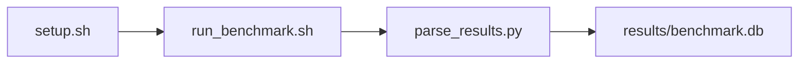

# BabelStream HBM Bandwidth Benchmark

[](LICENSE)
[](https://github.com/garys-gpu-benchmarks/415-gpu-bench-nvidia-babelstream-hbm-bandwidth-ubu2604/actions/workflows/ci.yml)

Target: Ubuntu 26.04 · NVIDIA · see Hardware Requirements. This is a host benchmark, not a laptop `pip install` project.

## Quick Start

```bash
git clone https://github.com/garys-gpu-benchmarks/415-gpu-bench-nvidia-babelstream-hbm-bandwidth-ubu2604.git
cd 415-gpu-bench-nvidia-babelstream-hbm-bandwidth-ubu2604
sudo bash setup.sh --assume-yes
bash run_benchmark.sh --profile smoke --validate
```
Results are written to `results/benchmark.db` and `results/summary.json`.

This workload is executed on the validation host after the repository is copied there. `setup.sh` and `run_benchmark.sh` do not open an outbound SSH session.

Prerequisites: Ubuntu 26.04; NVIDIA; Python 3.14.4; root or sudo for `setup.sh`. Framework: Bash, SQLite, Python, PyYAML, CUDA Runtime, NVCC. This is a host benchmark, not a laptop `pip install` project.



## 1. Overview

Builds src/babelstream.cu (FP64 device arrays) and runs scripts/collect_babelstream.py. device_id, array_size, block_size, warmup_iters, and num_iterations come from yaml. dtype is recorded in CSV but the CUDA kernel always uses double. kernels Copy/Mul/Add/Triad/Dot all run; there is no per-kernel time or percent-of-peak column Sweep dimensions: device_id, dtype, block_size, array_size, kernels, warmup_iters, num_iterations, output_format.

## 2. What It Validates

- Validates Copy, Mul, Add, Triad, and Dot bandwidth from one BabelStream run
- #1: Copy bandwidth (bandwidth_gb_s_copy); is present and physically sensible.
- #2: Mul bandwidth (bandwidth_gb_s_mul); is present and physically sensible.
- #3: Add bandwidth (bandwidth_gb_s_add); is present and physically sensible.
- #4: Triad bandwidth (bandwidth_gb_s_triad); is present and physically sensible.
- #5: Dot bandwidth (bandwidth_gb_s_dot) is present and physically sensible.

## 3. Metrics Captured

- **#1: Copy bandwidth** — stored as `bandwidth_gb_s_copy`.
- **#2: Mul bandwidth** — stored as `bandwidth_gb_s_mul`.
- **#3: Add bandwidth** — stored as `bandwidth_gb_s_add`.
- **#4: Triad bandwidth** — stored as `bandwidth_gb_s_triad`.
- **#5: Dot bandwidth** — stored as `bandwidth_gb_s_dot`.

## 4. Hardware Requirements

### Supported environment

- OS: Ubuntu 26.04
- GPU vendor: NVIDIA
- Framework family: Bash, SQLite, Python, PyYAML, CUDA Runtime, NVCC
- Python: Python 3.14.4

### Reference validation environment

The tables below describe the machine used to generate the reference results. They are not a requirement that every user buy that exact cloud instance.

### System

Builds src/babelstream.cu (FP64 device arrays) and runs scripts/collect_babelstream.py. device_id, array_size, block_size, warmup_iters, and num_iterations come from yaml. dtype is recorded in CSV but the CUDA kernel always uses double.

### GPU

Ubuntu 26.04 / NVIDIA / Bash, SQLite, Python, PyYAML, CUDA Runtime, NVCC

## 5. Software Requirements

| Component | Version |
|---|---|
| OS | Ubuntu 26.04 |
| Kernel | kernel 7.0.0 |
| Python | Python 3.14.4 |
| ROCm | CUDA 13.3 |
| rocBLAS | N/A - rocBLAS not used |

Builds src/babelstream.cu (FP64 device arrays) and runs scripts/collect_babelstream.py. device_id, array_size, block_size, warmup_iters, and num_iterations come from yaml. dtype is recorded in CSV but the CUDA kernel always uses double.

## 6. Installation

```bash
Compile babelstream.cu with nvcc; run bin/babelstream via collect_babelstream.py
```

## 7. Running the Benchmark

```bash
Compile babelstream.cu with nvcc; run bin/babelstream via collect_babelstream.py
```

**Validating results separately:**

```bash
export BENCHMARK_PYTHON=/usr/bin/python3.13  # optional
python3 -m venv .venv
source ".venv/bin/activate"
".venv/bin/python" scripts/validate_results.py
```

## 8. Output

### `results/benchmark.db` (SQLite)

BabelStream stdout parsed into raw_results.csv. Each kernel row and the summary row carry all five bandwidth columns

check,device_id,array_size,dtype,block_size,status,bandwidth_gb_s_copy,bandwidth_gb_s_mul,bandwidth_gb_s_add,bandwidth_gb_s_triad,bandwidth_gb_s_dot
Copy,0,16777216,fp64,256,ok,4200,4100,4300,4250,3000

```bash
Compile babelstream.cu with nvcc; run bin/babelstream via collect_babelstream.py
```

### `results/summary.json`

Consolidated metrics from the most recent run — suitable for CI artifact upload or dashboard ingestion.

### `results/raw/<timestamp>.txt`

BabelStream stdout parsed into raw_results.csv. Each kernel row and the summary row carry all five bandwidth columns

check,device_id,array_size,dtype,block_size,status,bandwidth_gb_s_copy,bandwidth_gb_s_mul,bandwidth_gb_s_add,bandwidth_gb_s_triad,bandwidth_gb_s_dot
Copy,0,16777216,fp64,256,ok,4200,4100,4300,4250,3000

## 9. Baselines / Thresholds

Expected ranges and gates live in `config/benchmark_config.yaml` under `baselines:` or `thresholds:`. To update them, edit that file — never edit validation code directly.

## 10. Troubleshooting

**`setup.sh` missing collector**
Create cannot finish without `scripts/collect_workload.py`.

**`self_check` overlay rewritten**
Do not overwrite files listed in `results/overlay_lock.json`.

**Remote SSH drop during setup**
Reconnect and resume `bash setup.sh --assume-yes`. Do not wipe `.venv` or `.cache`.

## 11. NVIDIA H100 Coding Differences

Native NVIDIA CUDA workload. Execute on the stated Ubuntu release with the host NVIDIA driver and CUDA userspace. ROCm porting notes do not apply.

## Repository layout

```text
.
├── setup.sh
├── run_benchmark.sh
├── benchmark_specification.json
├── .github/workflows/      # thin CI callers (see Continuous Integration)
├── config/
├── scripts/
├── src/
├── tests/
├── docs/
├── results/
└── LICENSE
```

## Continuous Integration

| Workflow | Runs on | When | What it does |
|---|---|---|---|
| [CI](.github/workflows/ci.yml) | GitHub-hosted runner | every pull request, and every push to `main` | shellcheck, ruff, `bash -n`, `compileall`, `run_benchmark.sh --help`, specification schema, the results validator on a seeded fixture, required files, and actionlint. No GPU and no benchmark run. |
| [GPU Smoke Benchmark](.github/workflows/gpu-smoke.yml) | self-hosted runner labeled `gpu`, `nvidia`, `ubu2604` | only when started by hand: **Actions → GPU Smoke Benchmark → Run workflow** (choose `smoke`, `baseline` or `extended`) | Verifies the pre-provisioned GPU stack, records `results/environment.json` (driver, runtime, kernel, GPU), runs the profile with `--validate`, shows headline metrics on the run page, and uploads the results. |

Both files are short callers. The steps themselves live once, for every workload in the suite, in [`garys-gpu-benchmarks/shared-workflows`](https://github.com/garys-gpu-benchmarks/shared-workflows), pinned at `@v1`. The GPU workflow is never triggered by pull requests, so code from a fork cannot run on the GPU host.

### Running it as part of the NVIDIA Ubuntu 26.04 bundle

This repository is one of the 32 workloads in [`bundle-nvidia-ubuntu-2604`](https://github.com/garys-gpu-benchmarks/bundle-nvidia-ubuntu-2604), which holds them as git submodules. To put the whole bundle on a GPU host and run this workload from it:

```bash
git clone --recurse-submodules https://github.com/garys-gpu-benchmarks/bundle-nvidia-ubuntu-2604 /opt/benchmarks
cd /opt/benchmarks/415-gpu-bench-nvidia-babelstream-hbm-bandwidth-ubu2604
bash run_benchmark.sh --profile smoke --validate
```
